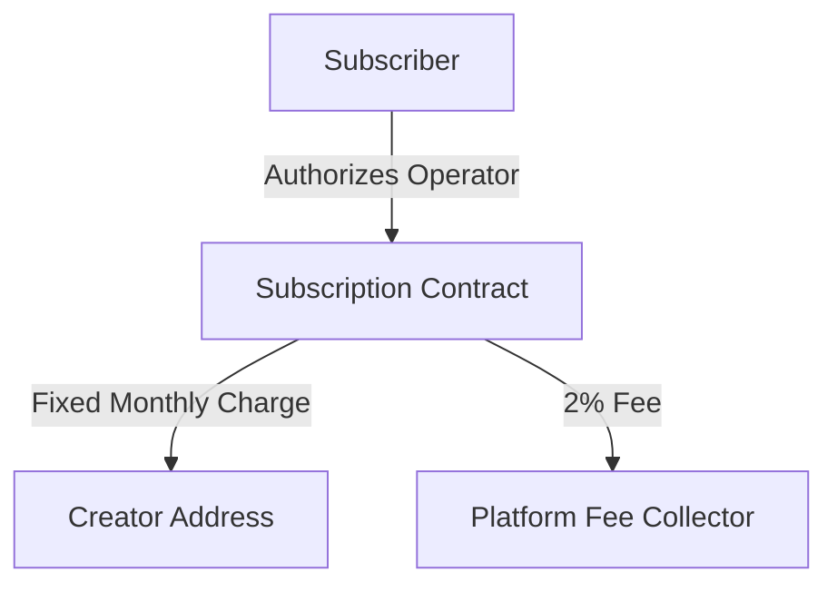

# Subz - Decentralized Subscription Management on LUKSO

<div align="center">
  
  [](https://opensource.org/licenses/MIT)
  [](https://lukso.network)
  [](https://docs.lukso.tech/standards/universal-profile/introduction)
  [](https://github.com/Deliquified/contracts-subz)
</div>

## 🌟 Overview

Subz revolutionizes the creator economy by enabling truly decentralized subscription management on LUKSO. Unlike traditional platforms, Subz eliminates intermediaries, empowering creators with:

- Direct creator-subscriber relationships
- No risk of deplatforming
- Minimal platform fees (2%)
- NFT-powered subscription benefits
- Complete control over content and revenue

## Demo

https://www.youtube.com/watch?v=B1P9ojKESTo

## 🎯 Key Features

### For Creators
- **Decentralized Control**: Deploy your own subscription contracts without platform dependency
- **NFT-Powered Subscriptions**: Each subscription tier mints unique LSP7 tokens
- **Flexible Payments**: Accept $FABS, $CHILL, $FISH tokens (stablecoins coming soon)
- **Automated Revenue**: Guaranteed on-time payments through smart contract automation
- **Multiple Tiers**: Create and manage different subscription levels
- **Low Fees**: Only 2% platform fee vs. 10-30% on traditional platforms

### For Subscribers
- **Universal Profile Integration**: Subscribe with your LUKSO identity
- **Secure Payments**: Fixed-price subscriptions with authorized operator model
- **NFT Benefits**: Receive NFTs representing subscription status
- **Automated Renewals**: Hassle-free subscription management
- **Direct Support**: Directly support creators without intermediaries

## 🔧 Technical Architecture

### Smart Contracts

#### Factory Contract
- Deploys individual subscription contracts for creators
- Manages contract registry and deployment parameters

#### Subscription Contract (LSP7-based)
- Implements LSP7 Digital Asset standard
- Handles subscription logic and payments
- Manages subscriber permissions and renewals

### Authorization Flow


## 🚀 Future Roadmap

### Phase 1: Enhanced LSP Integration
- Native LYX payment support using TRANSFER VALUE permissions
- Improved LSP4Metadata for subscription tiers
- LSP1 integration for batch transactions

### Phase 2: Extended Features
- Multiple subscription tiers with unique NFTs
- Content gating mechanisms
- Loyalty rewards and airdrops
- Advanced analytics dashboard

## 💻 Getting Started

### Prerequisites
- Node.js 16+
- Universal Profile Browser Extension
- LUKSO L16 testnet or mainnet account

### Installation

1. Clone the repository:
```bash
git clone https://github.com/yourusername/subz.git
cd subz
```

2. Install dependencies:
```bash
npm install
```

3. Configure environment:
```env
NEXT_PUBLIC_RPC_URL=https://rpc.lukso.gateway.fm
NEXT_PUBLIC_FACTORY_ADDRESS=your_factory_address
```

4. Start development server:
```bash
npm run dev
```

## 🔍 Technical Deep Dive

### Subscription Flow
1. Creator deploys subscription contract via factory
2. Subscribers authorize contract as operator
3. Contract manages fixed-price monthly charges
4. Automated system monitors and executes renewals
5. Platform fee (2%) automatically distributed

### Security Features
- Fixed-price immutable subscriptions
- Limited operator permissions
- Automated compliance checks
- Real-time monitoring

## 🤝 Contributing

We welcome contributions! See our [Contributing Guidelines](CONTRIBUTING.md) for details.

## 📄 License

This project is licensed under the MIT License - see the [LICENSE](LICENSE) file for details.

## 🔗 Links
- [Documentation](https://docs.subz.xyz)
- [LUKSO Docs](https://docs.lukso.tech)
- [Discord Community](https://discord.gg/yourserver)
